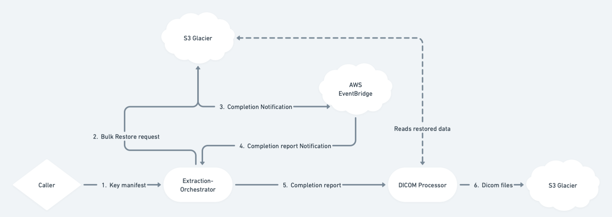
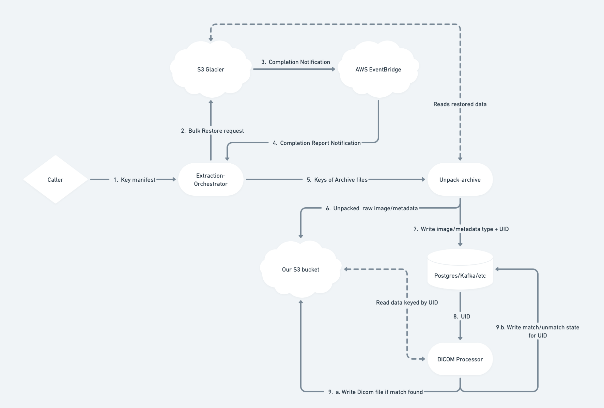

## 1. Introduction
We have the challenge of several billion DICOM files split into separate `image` and `metadata` archives stored on AWS' S3 Glacier Flexible Retrieval service.
We want to re-assemble the individual `metadata` and `image` data pieces back into complete `DICOM` files in an S3 bucket in an *efficient* and *cost-effective* manner, for ready use by ML processes. Total archived storage volume is in the order of several petabytes.

s the problem statement is deliberately underspecified, this document details minimal assumptions to reduce the problem to a tractable one, while detailing tradeoffs and changes required if assumptions are altered. Cost and operational concerns are also addressed.


#### Assumptions

Given the multifaceted nature of efficiency and the sliding scales of both efficiency and cost-effectiveness, we outline working assumptions to make the problem tractable.

Machine learning pipelines are typically compute and data-intensive, with a distinct bias towards throughput over latency, barring specific "online" systems. An appendix discusses potential design changes to accommodate more latency-sensitive use cases.
The data is inherently sensitive, and needs to be handled with the utmost care and privacy.

Depending on agreements with partners, it is also plausible that we may only have short-term access to the data. To avoid boiling-the-ocean, we will detail the requirements in a sub-section, but will explicitly operate under the requirement that our S3 buckets, and associated compute operates under suitably secure authentication/authorization IAM setups.

What constitutes "cost-effective" is also a function of the organisation, and while the design in this document will minimises "incidental" or needless expense, often organisations are happy to incur extra costs in return for peace-of-mind/security/velocity/etc. This is often a case-by-case basis, so it's plausible that certain decisions made here fall into the "oh that's nothing, just pay it" basket.

To restore the data from Glacier, AWS requires that you provide the keys which you wish to restore. The problem specification does not detail how these keys are provided to us, and indeed, whether it would be _us_ that is performing the restore from Glacier, or our partner. For completeness, we assume that we are provided with the manifest and are entirely responsible for restoration and processing. If this is not the case, the solution sections pertaining to this can be disregarded.

## 2. Problem Detail

The fundamental problem we have to solve is a find-and-join, of impressive scale. Source data is in `Tar` archives, which need to be read (scanned through at a minimum) to discover the contents. Each file within the archive is uniquely identified by it's `SOP Instance UID`. For any given metadata `json`, we don't know which archive the matching `image` data is present in and we cannot rely on any kind of reliable sorting within the archives, which means we either unpack them, or search them each time. Searching each time would result in wasted IO and money, as a successful match still throws away information about what other ids are present in that archive.

The actual re-assembly procesto output the `dcm` file is not a particularly CPU intensive process, meaning the majority of our task is IO-focused. It is therefore important that we structure our code + solution to be running as much IO concurrency as possible.

Fundamentally, this task requires us to provide an efficient way to:
1. Discover IDs present in archives. It doesn't matter whether we use the image or the metadata to do this. Ideally both datasets would be the exact same size, but in the event of corrupt or missing data, we should prefer to use the smaller dataset to discover ID's from.
2. Use these IDs to find the matching `metadata` and `image` data.
    a. There's many approaches to solving this, but at it's core, it's an inner-join. This can solved out-of-core, in-memory, or incrementally.
3. Fuse them together, and write the resulting data out.

The main challenge we will address is the scope of data we have to deal with: primarily how to efficiently store, lookup and retreive ~1 billion unique keys and their associated data, quickly and cost-effectively.


## 3. Detailed System Overview
We present a few potential solutions for the problem, with associated tradeoffs, to cover a range of scenarios.

## Part 1. Getting the data
However we choose to process the data, we first need to restore it from Glacier. AWS provides a variety of solutions for this, depending on your requirements:
- The `BULK` priority system is free of charge for object restores, but takes the longest amount of time: between 5-12 hours to finish.
- The `Standard` priority system (using Batch operations) will finish in the order of minutes to ~5 hours, and costs `$0.06 per 1000 requests` and `$0.012 per GB` of data restored.

For petabyte-scale restorations, this would cost around `~$12,000` AUD per run. Given the possibility of requiring multiple passes or runs, costs can rapidly escalate and should be reserved for scenarios with severe latency requirements or explicit business justification.

When restored, copies of the restored objects are made available for a number of days at `S3 Standard` Tier, after which they are deleted. Depending on the solution and business requirements, we can copy this data over to an S3 bucket we control, or act on it in place, choosing instead to only write the resulting `dcm` files to our S3 bucket.

To manage this initial flow, we will use a very simple stateless service we will dub the "Extraction Orchestrator".
This service will be responsible for receiving manifest data about what to restore, initiating `Bulk` restore calls to S3, receiving job completion notifications from EventBridge, and recording the status changes of these coarse "tasks" in a database such as Postgres. This allows tracking of overall pipeline action status, retrying if necessary, and provides a single dispatch point for downstream jobs. The specific invocation mechanism for downstream jobs (e.g., messages over Kafka, Postgres-as-a-queue, etc.) is an implementation detail dependent on resourcing, existing infrastructure, and operational concerns. The chosen mechanism should be durable to prevent job loss and ensure failure recovery.

### 1. The "Big Iron" Solution
The capabilities of modern cloud hardware are staggering. One solution is to have a single, sufficiently large machine stream over all the data, building a pair of hashmaps (one for metadata, one for images) associating each UID with its containing archive's S3 key.
- The service starts up, and using the S3 API's asynchronously streams through both the `image` and `metadata` datasets
- For each tar-file, we build a Rust HashMap keyed by `SOP Instance UID`, with the value being the S3-key of the tar-archive it belongs to. We do this for both `metadata` and `image data`.
- Approximating the length of the `SOP Instance UID` to, say, 30 bytes, at 1-billion entries + bookkeeping gives us a hashmap that will comfortably fit in ~130Gb of memory.
- We can rent an `r6g.12xlarge` that has 384Gb of Memory and 48 cores for about $1.80/hour AUD
- Running one of these HashMaps for metadata and images each, leaves us with a full ~120gb of memory spare.
- We can drain-iterate over one of the HashMaps joining against the other hashmap in the process, dispatching the matching `(uid, metadata_key, image_key)`triple out as an async task to grab the data from the matching keys and re-assemble the dicom data and write it out to S3.

##### Advantages
- Mechanically and operationally simple; quick to write and deploy
- Single library/binary avoids inherent distributed system complexities
- Keeping data in a single machine avoids performance and cost pitfalls like serialization overhead and costs associated with network traffic and intermediate storage
- Single machine minimizes failure modes
- Efficient in-process representation packs substantial data into the machine, avoiding expensive cloud service costs for transient intermediate data
- Cost efficiency derives from a model akin to CPU "race to idle":
	- Sufficient compute power allows faster work completion and quicker machine idling/rental termination
- Powerful low-hanging optimizations are available:
	- Finite-State-Transducer combined with external-chaining hashmap for more compact `uid -> s3 key` queries
	- `tar` files are series of appended archive files. When scanning to determine which `uid`s are present, capturing the byte offsets of each `uid`'s data start and end enables using S3 range-queries to slice this data directly from the archive without pulling the entire object


##### Downsides
- Large failure blast radius - machine failure loses in-progress work
- Directly working on restored files risks data loss when they expire, unless affordances are made to move them to our S3 bucket, incurring cost; however, this enables later reuse of persisted raw data
- Requires sufficiently large machine for single-pass processing
- Fairly coarse scaling and fixed scheduling:
	- While a single large machine can process a lot, machine size is ultimately limited
	- Multiple jobs would require multiple machines
	- Efficiency relies on maximum machine utilization, and due to the task's coarse nature, under-utilized capacity can't easily be used for other tasks
- While it could be added at the cost of extra API calls and latency, there's inherently no logic to check output state and avoid redundant work if it fails partway through a dataset

##### Failure modes
This model has fairly "nice" failure modes. Being largely self-contained with deterministic outputs under the same dataset, it can be treated as effectively idempotent. With the addition of "marker" metadata output, it can also be made "atomic."
- Successful completion guarantees all possible data was matched and written
- Writing a row to an ACID store indicating total job success can be used as a "commit marker," indicating safe readability by consumers
- Re-running after failure or even success simply causes the same data to be transparently overwritten byte-for-byte
	- For correctness-critical scenarios, this powerful guarantee makes performance easier to fix than fundamentally incorrect data or logic.


##### Dataflow diagram


### 2. Staged Pipeline Solution
Rather than working on the restored data in-situ, this approach progressively unpacks and processes it at the smallest possible level of granularity, allowing maximum parallelism as early as possible. As we're serializing in-progress data, we gain fault-tolerance and the ability to later reuse artifacts at the cost of higher storage.

Similar to Solution 1, we consume the "Extraction Orchestrator" output, but rather than directly building an index against the restored data, we consume the completion report, splaying individual keys out to worker services that read the restored archives, unpack them, and write the resulting members into an S3 bucket we control, keyed by data type and UID (e.g., `raw/{image, metadata}/2.25.32906972551432148964768`).
We also write the `UID` portion of the key (`2.25.32906972551432148964768`) to a datastore with a small amount of metadata.
For the datastore, we have several situation-dependent options:

1. A set of heavily-partitioned Kafka topics:
	- A topic for new IDs
	- A topic for unmatched IDs
	- A topic for matched IDs
2. A table of a form akin to:
	```rust
	struct {
	uid: SmartString,
	state: UidState,
	last_update: OffsetDateTime,
	}
	enum UidState {
	Unprocessed,
	UnMatched(u16),
	Matched
	}
	```

-  Knowing more about the specific structure of the `UID` would let us store an address it more compactly. 
- The specification provided [here](https://dicom.nema.org/dicom/2013/output/chtml/part05/chapter_9.html) asserts that there is an `Org Root` prefix, and an `ASN.1` style suffix, but does not detail anything around expected length or format of the `Org Root` prefix.
	- Successfully being able to parse out an `Org Root` would permit a powerful degree of partitioning on our dataset, yielding complexity and performance benefits in return. It would also permit prefix-compression, drastically reducing our storage overhead.
	- Using an OLTP database like Postgres will permit efficient in-place updates, and should cope with a table of this size at the cost of some performance loss, and higher storage costs.
	- An OLAP database, or "disaggregated compute" style warehouse like ClickHouse/Databend/Snowflake will comfortably handle billions of rows, and column-level layout permits better compression than row-wise, at the cost of not being optimised for updates. In this scenario, we'd treat the table as an append-only-log.

An adjustable number of "Dicom Processor" worker services would would have `new/unmatched` UID's distributed to them via push/pull depending on the data-store, and would take this ID, and attempt to concurrently `GET` the matching `uid` data from both the `image` and `metadata` subpaths of the S3 bucket. On receiving both, they'd perform an operation similar to the python script in the first section of the tech test: re-assemble the `Dicom` file, write it to the output S3 bucket, and update the datastore accordingly. If they only received 1/2 of the necessary pieces of data, they'd simply update the datastore indicating that this `UID` is unmatched, and proceed to the next piece of work.

The case where a worker does not receive both pieces could be due to a number of factors:
- We have started processing the dataset before the upstream `unpack-archive` stage has finished unpacking all the archives, and the other "half" of the data is yet to be written. In this case, we simply want to put this piece of work at the end of the queue, and proceed to the next one, assuming that it will be written in the interim. This is similar to the "operator" model taken by Kubernetes Custom Resource Definition Controllers.
- If the whole dataset has been unpacked, it's possible that there are errors, and some keys do not have both "halves". In this case, it is plausible that some keys will *never* be matched. To prevent the worker services from spinning endlessly and wasting resources on simply invalid or corrupt data, each time they are placed back on the queue as a result of being unmatched, we increment a counter, after some configurable threshold we stop attempting to match this value and regard it as failed.


##### Advantages
- Compared to the "big iron" solution, task granularity is significantly smaller, allowing more flexible task scheduling and distribution; ideally, we can keep more of the system busy more easily, and when there's insufficient work, it can be scaled in.

- More flexible scaling - as we're not constrained to a single machine anymore, we can scale separate components of the system up and down as need be: more "archive-unpacking" workers when the dataset first land, and more "dicom-processor" workers as unpacked data lands in S3.

- Producing intermediate data and tracking more progress yields superior fault-tolerance; it's also easier to resume from "partway through" by triggering appropriate notifications/updating rows
	- This design also permits easy re-use of source artifacts, and in the event of data-loss, easy regeneration of downstream dicom artifacts without the need to re-retrieve them from Glacier.
- We get adjustable parallelism much earlier in the process.
- Parallelism at each stage can be dynamically tuned according to business and budget requirements.
- As processing is not all-in-one, and everything from the "archive-unpacking" onwards doesn't actually _care_ which restore job the data came from, we can easily funnel data from both jobs into the same queues and both workloads will still be processed correctly. This can help maximise machine utilisation, as there's practically _always_ work to be done.
- Being a distributed system, we can tolerate degradation and failures in subsections without the whole system blowing up.
- Automatic back-pressure if using a system like Kafka can be beneficial for system stability.

##### Disadvantages
- There are significantly more moving parts - increasing the operational, cost and maintenance burden
- Distributed systems are prone to "grey failures", mystery slowdowns, and unexpected parts failing. Without proper observability and support, detecting and diagnosing these issues is difficult.
- Distributed systems are harder to test to the same level of confidence, and harder to run and debug locally.
- Higher costs incurred:
	- More intermediate data is stored
	- higher storage, compute and network costs for kafka and/or database relative to Solution 1.
- Care needs to be taken when acknowledging offsets, or locking/unlocking rows lest events be lost to the void, or rows permanently locked.

##### Failure Modes
If care is not taken with row/offset distribution, work can be accepted, a worker can fail midway through, and the final result may be lost.
Final stage writes are still idempotent.
If producers naively ignore backpressure, consumers stall for too long, or do not perform work fast enough, tables and topics can reach limits and the system can rapidly grind to a halt.
Poorly implemented sharding, or row-level locks can cause resource starvation and lock-contention, resulting in a system that performs at a snails pace.
Most of these scenarios shouldn't cause corruption or data-loss and as a whole, the system being decomposed into independent services is done to provide isolation and blast-radius control, and done even reasonably well can result in quite high overall throughput. However distributed systems are notorious for having difficult to diagnose bugs.


##### Dataflow diagram



## Summary
This document presents a scalable, efficient, and cost-effective solution to reassembling billions of DICOM files. We have detailed our assumptions and provided two viable architectures, each with its own set of tradeoffs.

The choice of which solution to use would be a function of team capacity, operational support, budget, existing infrastructure and input on requirements from the business.


My personal recommendation, would be to start simple - start with solution 1, getting a working version in place, followed by some observability as soon as reasonable. Load test as much as reasonable, and progressively scale it up in machine size + batch size in prod to find the best combination of throughput, pricing and operational overhead.

Once Solution 1 is running, we can gradually transition towards Solution 2 by extracting subsections from the "monolith" as the need for the advantages offered by the second architecture arises. Since the core logic is largely the same across both solutions, much of the code should be reusable, primarily requiring the addition of networking and state-persistence components. If domain-specific knowledge about the structure of `SOP Instance UID`s is available to enable partitioning, it should be leveraged as early as possible to further optimize the system.

In conclusion, this document outlines our assumptions and presents two architectures, their respective tradeoffs, and a migration path between them as a comprehensive solution to the given problem.

## Appendices
### Appendix A: Changes for Latency Sensitive preferences

If latency is a primary goal, then some simple changes to the pipeline can be made to address this. Primarily, at *great expense*, we can elect for the "immediate retrieval", which reduces the available duration before data is available to the order of minutes. If clients are setup to consume data as it comes in, the Second solution may be better fit, as the event-driven model is more suited to piecemeal work.

### Appendix B: Privacy and Security requirements

Given the sensitive nature of the source material, and the metadata presumably containing other information, which if not immediately PII, could plausibly be easily linked to other data to become PII, so it reasonable to scope out some guidelines around data security and authentication/authorization.

Both proposed solutions share a similar set of architectural pieces, with solution 2 having marginally more moving pieces.

We assume that the S3 Glacier bucket is controlled by the partner, but has sufficient security in place. Unless specified, we will assume it will be governed by a similar set of guidelines as detailed here.
- Access and visibility to the bucket should be controlled by IAM roles with the minimum scope necessary.
- S3 buckets should absolutely have bucket-wide encryption key set, and access to the encrypt/decrypt functions of this key should be similarly gated behind IAM roles.
- If extra security is required, object-level encryption with a second key can be used.
- Audit trails should be enabled, exfiltrated to a separate, audit-specific AWS account to prevent leaking information and minimise tampering risk.
- IAM roles and overall account access should not be provided directly - a common solution is to have a "management" account, with 0 resources, that exists only to contain users. These users must have MFA/yubikeys, etc.
  User access to accounts is done via inheriting roles, a functionality governed by IaC controlled policies. This gives a central location to control available users in the system, and where they can go and what they can see, and helps prevent the profileration of "click-ops" account-by-account roles that can make the task of ensuring minimal access difficult.
- Depending on how services themselves are orchestrated (Kubernetes, ECS, etc) the platform equivalent of task-level permissions should be created. In AWS, for Kubernetes clusters, this is "Iam Roles for Service Accounts" (IRSA), which let you attach specific policies to a particular service account. This provisions short-lived, non-persisted tokens for services to use and greatly reduces the risk of keys leaking. In the event they do leak, the short-lived nature prevents serious long-term abuse.
- Traversal over the internet should be avoided where possible. This comes with cost and performance benefits too. VPC endpoints can be created for a wide variety of services, and some services such as PrivateLink permit you to wire up cross-account connections. The cost of traffic over these AWS internal services is far lower than the normal Egress charges.
- When using an orchestrator like Kubernetes, nodes should be kept in private subnets. Control plane access should also be locked down. Tools like Tailscale can interoperate with SSO providers, to ensure only permitted users are allowed into the same network space.
- Making certain buckets "write only" can prevent situations where "low level" services can end up having far more visibility than they should. On a more general data-flow level, this can also help ensure that dataflow, and data-lineage can be strictly controlled.
- A surefire way to prevent data from being leaked or exfiltrated, is to not have it in the first place - so if particularly sensitive data can be deleted (because it can be regenerated, or re-requested at will later on), then doing so is wise.
- If even more security is required, certain technology such as the AWS Nitro Enclaves provide a number of sophisticated secure computing features.


### Appendix C: Observability etc

An important pillar of any mission-critical workload is observing what the system is doing, and how it is behaving. This typically encompasses structured logging, metrics, and in more sophisticated systems, (distributed) tracing. Logging of warnings and errors, capturing as much context as possible should be considered a bare minimum. Logging

Metrics require slightly more setup, and care, but can provide significantly more insight into a system. Tools like Prometheus + Grafana are the common choice. In case of both solutions, a good selection of metrics to monitor would be:
- CPU utilisation percentage for each service, ideally broken down by core
- Memory use, as a percent of (allocated/available)
- Network ingress and egress rates
- Duration histograms on all IO
- Where possible: queue depth, produce/consume rate.
- Counters for success/failure on critical points
	- Establish "baseline" values for certain recoverable or expected errors/warning occurrence rates
- Whenever any Vectors/dataframes/etc are collected, it is worthwhile emitting metrics on their dimensions. Dashboards all being green, but no data coming out of the pipeline can often be caught by looking for 0-length vectors, which are often in turn a proxy that something silently failed or was filtered upstream.
- Try to establish baseline levels of error/warning occurrence and durations, before setting up any alerts.
	- This serves to prevent the issue where transient errors, or situations where the system will automatically recover in a few minutes incorrectly set off half a dozen alerts.
- If SLO's are being provided to consumers, Burn-Rate based alerts are handy way to easily measure severity and can prevent "minor" spikes setting things off prematurely.
